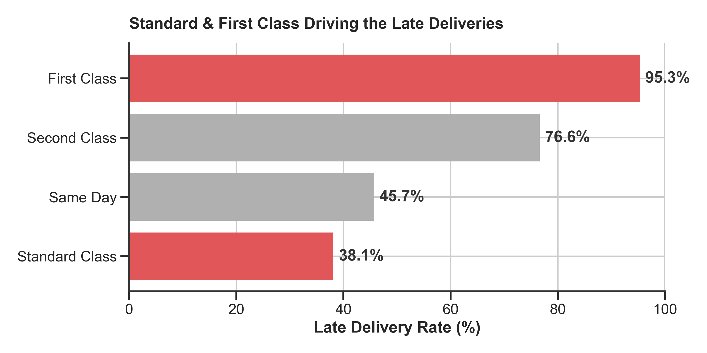
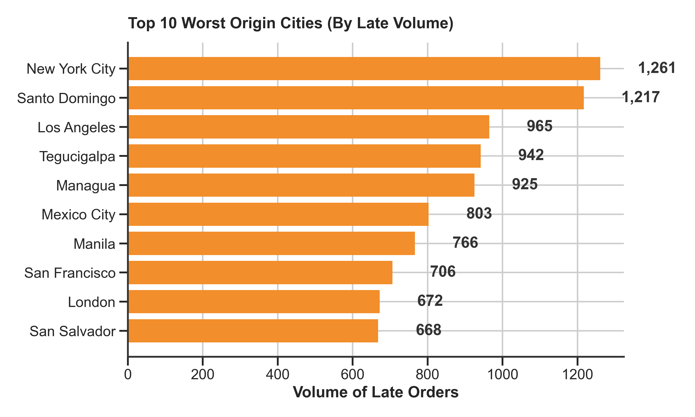
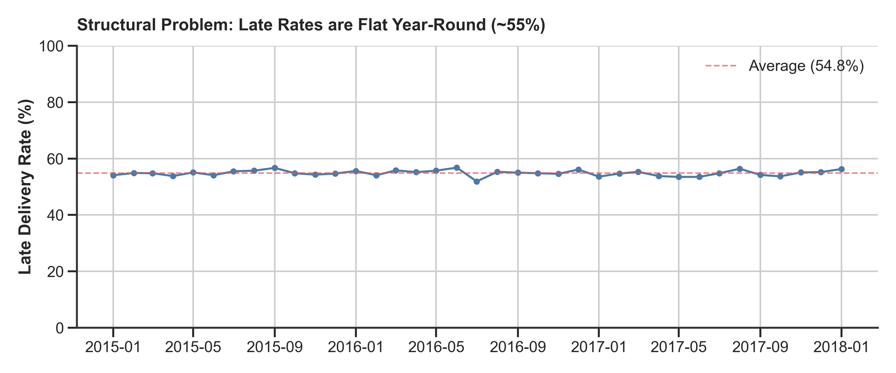
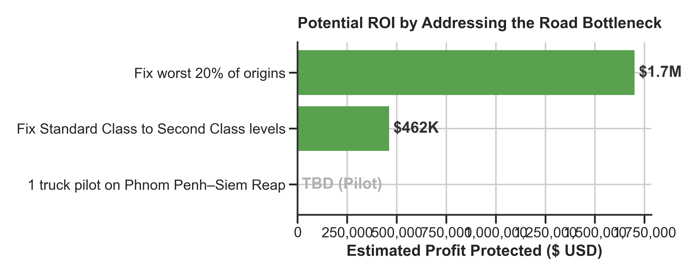

# Executive Summary — Mekong Distribution

**To:** Operations Director
**From:** Data Analysis
**Date:** July 2026
**Subject:** Late delivery root cause — trucks or warehouse upgrade?

---

## The problem

57% of our deliveries arrive late. Retailers are complaining. Some have started buying from competitors.

You have two investment requests on your desk totaling more than budget allows. This analysis determines which one addresses the root cause.

## The finding

**The bottleneck is on the road, not in the warehouse.**

**1. The warehouse isn't the problem.**
All delivery modes originate from the same warehouse, but Standard and First Class are driving the delays. The difference happens on the road.

**2. The problem is concentrated in specific routes.**
A Pareto analysis shows that delays are heavily concentrated. Addressing the routes leaving these 10 origin cities will have a massive cascading effect.

**3. The problem is structural, not seasonal.**
This is not a rainy season anomaly. The late rate has been stuck at ~55% every month for 4 years.

*(Note: While the direct profit difference between a late vs. on-time order is only $0.41, the true cost lies in customer churn which this data cannot quantify).*

## The recommendation

**Buy the trucks. Don't upgrade the warehouse yet.**

### Why

If the warehouse were the bottleneck, all delivery modes would be equally delayed. They're not. Standard Class — our most common mode — is disproportionately late. The difference is on the road.

Warehouse racking and a better inventory system would improve picking efficiency but wouldn't change delivery speed. The late rate would stay roughly the same.

### What to do

1. **This week:** Ask ops for carrier records. If one trucking company causes most standard-class delays, talk to them before buying our own trucks.
2. **Next month:** Buy 1 truck ($40K). Run it on Phnom Penh–Siem Reap — our busiest route. Measure late rates before and after for 3 months.
3. **If it works:** Buy the second truck for Phnom Penh–Battambang.
4. **If delays persist after in-house trucks:** Then investigate the warehouse. The bottleneck may be picking/packing after all.

### Estimated impact

## Data limitations

This analysis uses 180K orders from 2015–2018. The dataset lacks:

- **Carrier IDs** — can't name which trucking companies to drop or renegotiate with
- **Warehouse timestamps** — can't measure how long goods sit before dispatch
- **Freight costs** — can't calculate truck purchase ROI vs carrier fees
- **Customer churn data** — can't quantify how many retailers we've lost to late delivery

**Bottom line:** The data supports buying trucks. But get carrier records first — you may not need to buy anything if one carrier is the problem.

---

*Full technical analysis: `notebooks/02_root_cause_analysis.ipynb`*
